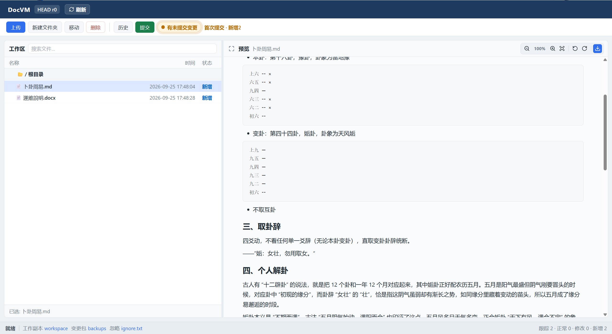

# DocVM — 本地文档版本管理

[](LICENSE)
[](https://www.python.org/)
[](https://github.com/yuJunOk/doc-version-manager)

本地 SVN 风格文档版本工具：无需 Git/SVN 服务端，工作副本 + CAS 增量提交，浏览器 UI，可打包为 Windows exe 双击即用。

详细设计见 [技术文档](docs/技术文档.md)。

## 界面预览



## 功能概览

- 工作副本管理（上传、目录、移动、删除、搜索筛选）
- 增量提交与修订历史（内容寻址，相同文件不重复存储）
- 忽略规则（`ignore.txt`）
- 历史回滚、修订文件下载、文本/文档差异
- Word / Markdown / 图片等预览（缩放、旋转、全屏）
- 系统托盘驻留；再次启动仅打开浏览器（单实例）

## 离线使用（推荐：exe）

**不需要安装 Python，也不需要联网、执行 `pip`。**

1. 在有网络的机器上打包出 `dist\DocVersionManager.exe`（见下方「打包 exe」），或直接使用已打好的 exe  
2. 把 **单个 exe** 拷到离线电脑任意目录  
3. 双击运行 → 托盘驻留，并自动打开本机页面 [http://127.0.0.1:404](http://127.0.0.1:404)  
4. 数据写在 **exe 同目录** 的 `.docvm/`（工作副本、版本库都在这里，可整夹备份/拷走）

说明：

- 再次双击 exe：若已在运行，只会再打开浏览器，不会起第二个服务  
- 结束：托盘图标 →「结束运行」  
- Word→PDF 高级预览依赖本机是否安装 Microsoft Word；一般 docx/Markdown/图片预览不依赖外网  
- 浏览器仍建议本机有 Edge/Chrome（打开的是本机 `127.0.0.1`，不访问公网）

## 从源码运行（开发用）

仅在改代码、调试时需要：

```bash
pip install -r requirements.txt
python main.py
```

> 这与离线部署无关。若本机 `pip` 访问官方 PyPI 报 SSL 错，可临时用镜像：  
> `pip install -r requirements.txt -i https://mirrors.aliyun.com/pypi/simple/`

## 目录结构

```
doc-version-manager/
├── main.py                 # 唯一入口
├── LICENSE                 # MIT
├── CONTRIBUTING.md
├── README.md
├── requirements.txt
├── docs/
│   └── 技术文档.md
├── docvm/                  # 应用包
│   ├── paths.py            # 路径 / 环境
│   ├── utils.py            # 通用工具
│   ├── preview.py          # docx / PDF 预览
│   ├── repo.py             # CAS 增量版本库引擎
│   ├── manager.py          # 工作副本门面
│   ├── server.py           # HTTP API
│   ├── tray.py             # 系统托盘
│   └── web/
│       ├── templates/      # 前端页面
│       └── static/         # JS 库
└── scripts/                # 打包脚本与 PyInstaller spec
```

运行后数据落在软件同目录 `.docvm/`：


| 路径           | 说明              |
| ------------ | --------------- |
| `workspace/` | 工作副本（编辑/上传）     |
| `objects/`   | 内容寻址存储（相同文件不重复） |
| `revs/`      | 修订元数据           |
| `ignore.txt` | 忽略规则            |
| `backups/`   | 本修订变更文件的小包      |


## 打包 exe

```bat
scripts\build.bat
```

产物：`dist\DocVersionManager.exe`。若依赖已安装，可 `set SKIP_PIP=1` 后跳过安装步骤。

## 依赖

- python-docx / mammoth — Word 预览
- pywin32 — Word COM 转 PDF（可选，需安装 Microsoft Word）
- pystray / Pillow — 系统托盘
- pyinstaller — 打包


## 贡献

见 [CONTRIBUTING.md](CONTRIBUTING.md)。Issue / PR 均欢迎。

## License

[MIT](LICENSE) © 2026 yuJunOk